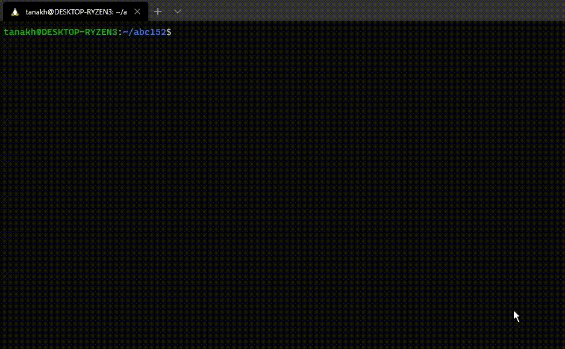
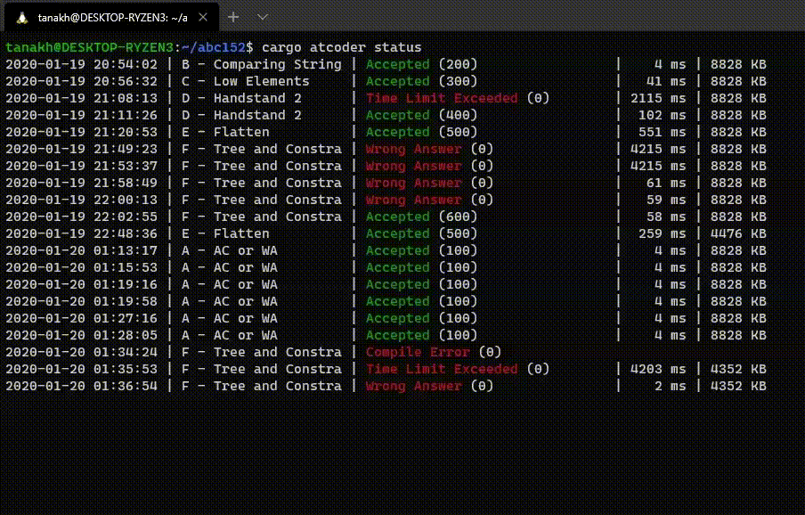

[](https://crates.io/crates/cargo-atcoder)

[](https://gitter.im/tanakh/cargo-atcoder?utm_source=badge&utm_medium=badge&utm_campaign=pr-badge&utm_content=badge)

# cargo-atcoder

Cargo subcommand for AtCoder

# 使い方

## インストール

```
$ cargo install cargo-atcoder
```

## ログイン

```
$ cargo atcoder login
```

でAtCoderにログインします。httpのセッションを保存します。ユーザー名とパスワードは保存しないので安心して下さい。`clear-session`コマンドでセッション情報を消せます。

## `target`ディレクトリの共有 (任意)

コンテスト用のプロジェクトを作成する前に、次の設定をすることをおすすめします。

プロジェクトを並べる予定のディレクトリで次のコマンドを実行してください。

```console
$ mkdir ./.cargo
$ echo '[build]\ntarget-dir = "target"' > ./.cargo/config.toml
```

これでこのディレクトリに[`build.target-dir`](https://doc.rust-lang.org/cargo/reference/config.html#buildtarget-dir)が設定され、そこから下にあるプロジェクト全体が一つの`target`ディレクトリを共有するようになります。
そうすることで外部クレートを使う場合、毎回それらのビルドが走ることがなくなります。

## プロジェクト作成

`new` コマンドでコンテスト用のプロジェクトファイルを作成します。

```
$ cargo atcoder new <contest-name>
```

必ずURLに含まれるコンテスト名で作成します。

例えば、ABC152 (<https://atcoder.jp/contests/abc152>) なら、`abc152`になるので、

```console
$ cargo atcoder new abc152
     Created binary (application) `abc152` package
```

これで`abc152`というディレクトリが作られて、そこにcargoのプロジェクトが作られます。

```console
$ tree ./abc152
./abc152
├── Cargo.toml
└── src
    └── bin
        ├── a.rs
        ├── b.rs
        ├── c.rs
        ├── d.rs
        ├── e.rs
        └── f.rs

2 directories, 7 files
```

ソースファイルは

1. コンテストが始まっていて参加している場合、問題一覧
2. コンテストのトップページの配点表

から得られた問題のアルファベットに従い作成されます。
開始前かつ配点表がトップページに無いコンテストではfile stemを`-b`, `--bins`で指定してください。

```
$ cargo atcoder new <contest-name> -b {a..f}
```

## 解答サブミット

作成したプロジェクトのディレクトリの中で、`submit`コマンドを実行すると解答をサブミットできます。

```
$ cargo atcoder submit <problem-id>
```

`problem-id`は、URLの末尾に含まれるものを指定します（例えば、<https://atcoder.jp/contests/abc152/tasks/abc152_a> なら、`a`）。


サブミット前に、問題文中のテストケースでテストを行い、全て正解した場合のみサブミットを行います。オプションで強制的にサブミットしたり、サブミット前のテスト自体のスキップもできます。

`--bin` オプションを付けると、ソースコードではなく、バイナリを送りつけます。静的リンクしたバイナリを送りつけるので、お好きな処理系と、お好きなcrateが使えます。

設定ファイルで、デフォルトでバイナリを送る設定にしたり、target tripleを設定したりできます。

[UPX](https://upx.github.io/)がインストールされていれば、自動的に使って圧縮します。インストールされていても使わない設定にもできます。

実行例：

```
$ cargo atcoder submit a --bin
```



デフォルトでは、なるべくジャッジの環境によらずに動くように、ターゲットとして `x86_64-unknown-linux-musl` を利用するようになっています。インストールされていない場合は、

```
$ rustup target add x86_64-unknown-linux-musl
```

でインストール出来ます。

## その他コマンド

### `cargo atcoder status`

自分のサブミット状況を適当にフェッチして表示します。リアルタイム更新されます。




### `cargo atcoder test`

テストケースの実行に特化したコマンドです。テストケースの指定や、verboseな実行ができたりします。

```
$ cargo atcoder test <problem-id>
```

`problem-id`の他に何も指定しなければ、問題文のページから入力例を自動的に取得して、全てに対してテストを行います。

```
$ cargo atcoder test <problem-id> [case-num]...
```

`case-num` には、`1`、`2`、`3` などの入力例の番号を1つまたは複数指定できます。`-v` を付けるとなんか少し多めに情報が出るかも知れません。

```
$ cargo atcoder test <problem-id> --custom
```

`--custom` を付けると、標準入力から入力するモードになります。

### `cargo atcoder gen-binary`

```
$ cargo atcoder gen-binary <problem-id>
```

`problem-id` のRustのコードとしてサブミットできるバイナリを生成します。`submit`の`--bin`オプションで生成する物と同じです。

### `cargo atcoder result`

```
$ cargo atcoder result [FLAGS] <submission-id>
```

サブミット結果の詳細を表示します。ACじゃなかった場合は結果の内訳を表示します。全テストケースが開示されている場合は全テストケースに対する結果を取得して表示します。

## 設定ファイル

`~/.config/cargo-atcoder.toml` に設定ファイルが生成されます。適当にいじって下さい（そのうち説明を書く）。

## macOS 環境の場合

設定ファイルは `~/Library/Application Support/cargo-atcoder.toml` に生成されます。

`x86_64-unknown-linux-musl` 向けのコンパイルを面倒無く実行するため、`[atcoder]` テーブル内で `use_cross = true` を指定するのがおすすめです。`use_cross` を有効化することで、[rust-embedded/cross](https://github.com/rust-embedded/cross) を使用したコンパイルを行うようになります。Docker が必要になるので注意してください。
crossのインストールもお忘れなく。
```
$ cargo install cross
```

また、実行バイナリを軽量化するために使われる `strip` コマンドが、macOS に最初から入っているものだとうまくいかないため、**GNU版**の `strip` を導入するのもおすすめです。Homebrewであれば以下を実行すればインストールすることができます。

```
$ brew install binutils
```

標準では `/usr/local/opt/binutils/bin` の中にインストールされます。
ここにPATHを通すか、あるいは `cargo-atcoder.toml` の `[atcoder]` テーブル内に以下のようにGNU版 `strip` の絶対パスを指定すればOKです。

```
[atcoder]
strip_path = "/usr/local/opt/binutils/bin/strip"
```
